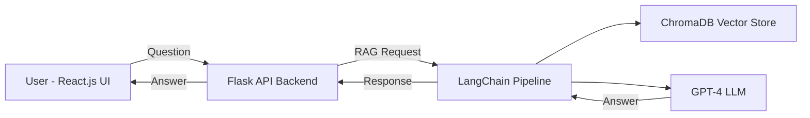

# AI-Powered Customer Support Chatbot 🤖

An intelligent AI assistant for customer support, trained on **product manuals, FAQs, and ticket history**, providing contextual answers using **RAG (Retrieval-Augmented Generation)** with **LangChain + ChromaDB** and deployed on **AWS ECS**.

---

## 🚀 Features

* **Contextual Answers:** Accurate responses using RAG pipeline
* **Multi-Source Knowledge:** Trained on manuals, FAQs, and ticket history
* **Interactive Frontend:** React.js UI for seamless customer interaction
* **Scalable Deployment:** Backend on AWS ECS
* **Extensible Architecture:** Easily add more documents or knowledge sources

---

## 📂 Project Structure

```
backend/
├── agents/
│   └── agent_fetcher.py     # RAG + GPT-4 agent
├── api/
│   └── app.py               # Flask API backend
├── requirements.txt
├── Dockerfile
frontend/
├── src/
│   ├── App.js               # React UI
│   └── App.css
├── Dockerfile
.env.example                  # Environment variables
docker-compose.yml            # Local testing setup
README.md                     # Project documentation
```

---

## 🏗 Architecture



* **Frontend:** React.js
* **Backend:** Flask API
* **RAG Pipeline:** LangChain + ChromaDB + GPT-4
* **Deployment:** AWS ECS / Docker

---

## ⚙️ Setup

### 1. Clone Repository

```bash
git clone https://github.com/hq969/customer-support-chatbot.git
cd customer-support-chatbot
```

### 2. Backend Dependencies

```bash
cd backend
pip install -r requirements.txt
```

### 3. Frontend Dependencies

```bash
cd ../frontend
npm install
```

### 4. Configure Environment

Copy `.env.example` → `.env` and add your OpenAI API key:

```
OPENAI_API_KEY=your-openai-api-key
CHROMA_COLLECTION_NAME=customer_support
```

### 5. Run Locally

```bash
# Backend
cd backend
python app.py

# Frontend
cd ../frontend
npm start
```

Open [http://localhost:3000](http://localhost:3000) to interact with the chatbot.

---

## 🚀 AWS ECS Deployment

1. **Create ECS Cluster** (`Fargate` recommended)
2. **Push Docker Images** to AWS ECR:

```bash
# Backend
docker build -t customer-support-backend ./backend
docker tag customer-support-backend:latest <aws_account_id>.dkr.ecr.<region>.amazonaws.com/customer-support-backend:latest
docker push <aws_account_id>.dkr.ecr.<region>.amazonaws.com/customer-support-backend:latest

# Frontend
docker build -t customer-support-frontend ./frontend
docker tag customer-support-frontend:latest <aws_account_id>.dkr.ecr.<region>.amazonaws.com/customer-support-frontend:latest
docker push <aws_account_id>.dkr.ecr.<region>.amazonaws.com/customer-support-frontend:latest
```

3. **Create ECS Task Definitions**

   * Backend Task: port 5000, environment variables from `.env`
   * Frontend Task: port 3000

4. **Create ECS Services** using the tasks

5. Configure **Application Load Balancer** if public access is needed

---

## ⚡ CI/CD (GitHub Actions)

* Automatically build and push Docker images on `main` branch
* Updates ECS services automatically

```yaml
# .github/workflows/deploy.yml
name: ECS Deploy

on:
  push:
    branches:
      - main

jobs:
  deploy:
    runs-on: ubuntu-latest
    steps:
      - uses: actions/checkout@v3
      - uses: aws-actions/configure-aws-credentials@v2
        with:
          aws-access-key-id: ${{ secrets.AWS_ACCESS_KEY_ID }}
          aws-secret-access-key: ${{ secrets.AWS_SECRET_ACCESS_KEY }}
          aws-region: us-east-1
      - run: |
          docker build -t customer-support-backend ./backend
          docker tag customer-support-backend:latest <aws_account_id>.dkr.ecr.us-east-1.amazonaws.com/customer-support-backend:latest
          aws ecr get-login-password --region us-east-1 | docker login --username AWS --password-stdin <aws_account_id>.dkr.ecr.us-east-1.amazonaws.com
          docker push <aws_account_id>.dkr.ecr.us-east-1.amazonaws.com/customer-support-backend:latest
      - run: |
          docker build -t customer-support-frontend ./frontend
          docker tag customer-support-frontend:latest <aws_account_id>.dkr.ecr.us-east-1.amazonaws.com/customer-support-frontend:latest
          docker push <aws_account_id>.dkr.ecr.us-east-1.amazonaws.com/customer-support-frontend:latest
      - run: |
          aws ecs update-service --cluster customer-support-chatbot-cluster --service backend-service --force-new-deployment
          aws ecs update-service --cluster customer-support-chatbot-cluster --service frontend-service --force-new-deployment
```

---

## 💡 Benefits

* Cuts support response time dramatically
* Provides **contextual and accurate answers**
* Scales effortlessly with AWS ECS
* Easily extendable with new knowledge sources

---

## 👨‍💻 Author

Built by **Harsh Sonkar** ⚡
#AI #LangChain #ChromaDB #OpenAI #ReactJS #AWS #MachineLearning #RAG #FinTech #CustomerSupport

---

I can also create a **ready-to-post LinkedIn version with this ECS + CI/CD info included** so it highlights your **production deployment skills**.

Do you want me to do that next?
